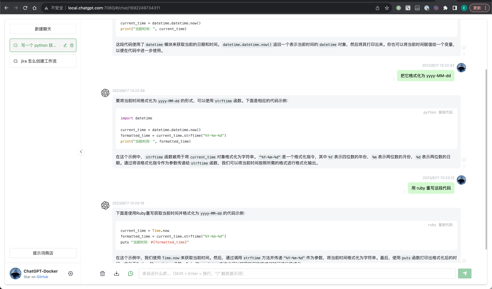
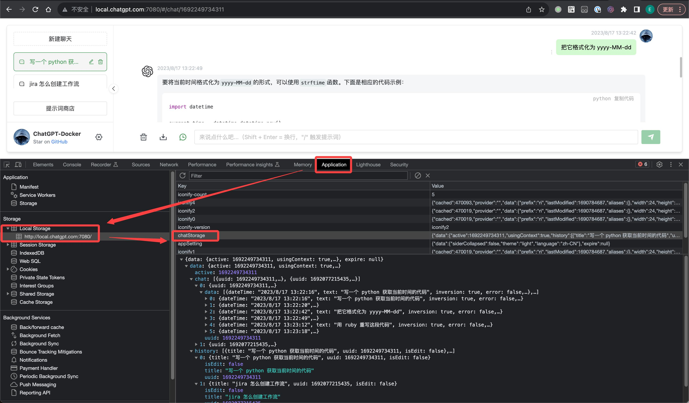

# chatgpt-docker

> docker 一键部署 ChatGPT 服务端

------

## 运行环境

  

## 概要

通过 [openai](https://platform.openai.com/) 的 [API](https://platform.openai.com/account/api-keys) 调用 [ChatGPT](https://chat.openai.com/) 的能力，便于共享给家人使用：

历史对话存储在浏览器中，确保个人隐私：

优点：

1. Docker 一键部署，任何环境均可使用
2. 模仿 ChatGPT 的操作 UI，保持用户习惯
3. 在个人 VPS 上部署可免处挂梯子麻烦，便于家人共享
4. 避免一号多用带来的风控
5. Web 页面有 BasicAuth 认证，防止未授权访问
6. 自带防爬虫机制，避免被搜索引擎抓取

> 本质就是通过官方 API 使用 ChatGPT 的能力，与直接使用 ChatGPT 是一样的。API 好处是自选模型，价格上比 ChatGPT Plus 包月划算。

## 准备

1. 部署一台 [VPS 服务器](https://github.com/EXP-Tools/trojan-docker)（可用于直接部署 ChatGPT-Docker、亦可用于本地部署后利用 VPS 代理科学上网再使用）
2. VPS/本地安装 [docker](https://www.docker.com/)、docker-compose
3. VPS/本地安装 [python3](https://www.python.org/downloads/)
4. 申请一个 [openai](https://platform.openai.com/) 账户，同时绑定一张境外银行卡以激活 API 调用权限（费用自负）
5. 生成一个 [API key](https://platform.openai.com/account/api-keys)

## 部署步骤

1. 安装依赖： `python3 -m pip install -r py/requirements.txt`
2. 构建镜像： `bin/build.sh`
3. 生成 Nginx BasicAuth： `python py/gen_basicauth.py -u "chatgpt" -p "TPGtahc#654321"`
3. 运行容器： `bin/run.sh|ps1 -k "${OPENAI_API_KEY}"`
4. 访问服务： http://127.0.0.1:7080 （默认账密: `chatgpt / TPGtahc#654321`）

> Nginx 支持多个 BasicAuth，可以重复执行 `python py/gen_basicauth.py` 命令得到帐密后，把他们复制到 .basicauth 中即可（一行一个帐密）

更多运行参数：

| 参数 | 示例值 | 说明 |
|:---|:---|:---|
| `-t ${PROTOCOL}`| https | Web 页面使用 http/https 协议 |
| `-d ${DOMAIN}]` | local.chatgpt.com | 服务域名（浏览器访问地址），没有申请域名时需指定为 IP。亦可指定本地域名、使用 sudo （管理员权限）执行脚本会自动把本地解析写到 hosts |
| `-i ${IP}` | 127.0.0.1 | 域名解析到的 IP，若需要对公访问，这里需要设置为公网 IP |
| `-k ${OPENAI_API_KEY}` | `sk-...abcd` | ChatGPT [API key](https://platform.openai.com/account/api-keys) |
| `-m ${OPENAI_MODEL}` | gpt-3.5-turbo | ChatGPT Model，枚举值和价格请参考[官网文档](https://platform.openai.com/docs/models/overview) |
| `-s ${SOCKS_PROXY_HOST}` | host.docker.internal | Socks5 代理服务，如果代理在宿主机上，需要使用 host.docker.internal 作为 IP |
| `-r ${SOCKS_PROXY_PORT}` | 10089 | Socks5 代理服务端口 |
| `-r ${HTTPS_PROXY}` | http://host.docker.internal:10088 | HTTP 代理服务，和 Socks5 二选一 |

## 其他

本项目引用了 [chatgpt-web](https://github.com/Visuals-AI/chatgpt-web) 作为子工程，主要是修改了原工程的部分配置代码。

拉取子工程更新： `git submodule update --remote --recursive`
